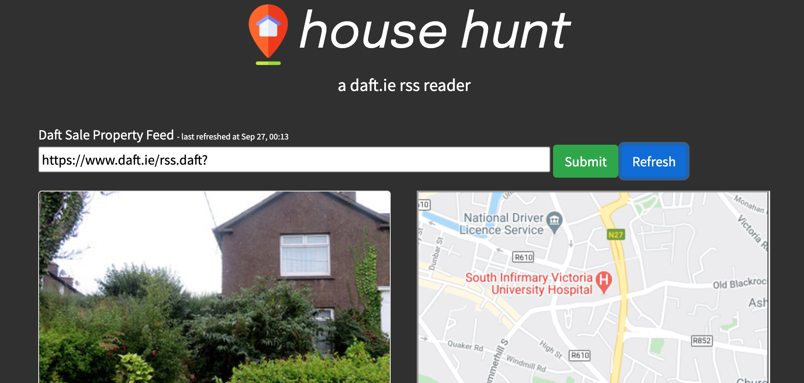

# house-hunt
a daft.ie rss reader 
www.shenhennigans.com/househunt 
<h3>Desktop</h3>

<h3>Mobile</h3>

<ul>
<li>get listings via daft.ie rss feed</li>
<li>show map of property without having to click into the listing</li>
<li>auto-refresh for monitoring new listings</li>
<li>saves search in local storage until new rss feed url entered or local storage cleared</li>
</ul>

To get a rss feed url, you must login to daft.ie 
Create a search and click the 'RSS' link above the search results 
